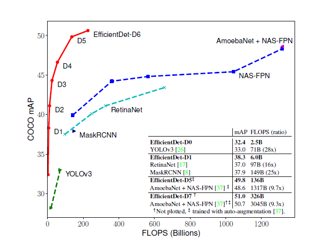

# EfficientDet_PyTorch

注意事项(NOTICE):  
1. 训练请使用SGD优化器(with momentum). 不要使用Adam. 会造成不收敛.  
预训练期间学习率不要过大     
Use SGD optimizer for training(with momentum). Do not use Adam. It will cause a nonconvergence  
During the pre-training, the learning rate should not be too high   

2. 有两个分支，一个是按照论文书写(official)、一个是参考`zylo117`的代码(master)，
并使用了他的预训练模型书写(万分感谢)，请按实际情况选择   
There are two branches, one(official) was written according to the paper, 
the other(master) was written referring to the code of 'Zylo117' and use his pre-training model(thank you very much), 
please choose according to the actual situation    

3. `train_example.py`的意义是展示模型输入的格式   
The meaning of `train_example.py` is to show the format of the model input    

4. 自己训练的时候，请使用`EfficientNet`预训练模型、并`Freeze BackboneBN`(推荐使用official)    
Use 'EfficientNet' pre-training model and 'Freeze BackboneBN' when you train yourself 
(Official is recommended)   

## Reference
1. 论文(paper):   
[https://arxiv.org/pdf/1911.09070.pdf](https://arxiv.org/pdf/1911.09070.pdf)  

2. 代码参考(reference code):  
[https://github.com/zylo117/Yet-Another-EfficientDet-Pytorch](https://github.com/zylo117/Yet-Another-EfficientDet-Pytorch)

3. EfficientNet 主干网代码来源(Backbone code source):  
[https://github.com/Jintao-Huang/EfficientNet_PyTorch](https://github.com/Jintao-Huang/EfficientNet_PyTorch)  

4. 预训练模型来自(The pre-training model comes from):  
[https://github.com/zylo117/Yet-Another-EfficientDet-Pytorch](https://github.com/zylo117/Yet-Another-EfficientDet-Pytorch)   
因为修改了模型，所以我把预训练模型的state_dict进行了重组，并进行发布  
(Because I changed the model, I reorganized the state_dict for the pretraining model and release it)  


权重见 release. 或在百度云中下载:  
链接：[https://pan.baidu.com/s/1VrO0eBmSHlB8_haEJ7WbuA](https://pan.baidu.com/s/1VrO0eBmSHlB8_haEJ7WbuA)   
提取码：2kq9  


## 使用方式(How to use)

#### 1. 预测图片(Predict images)
```
python3 pred_image.py
```

#### 2. 预测视频(Predict video)
```
python3 pred_video.py
```

#### 3. 简单的训练案例(Simple training cases)
```
python3 train_example.py
```

## 性能 
如果打不开可在`images/`与`docs/`文件夹中查看  



#### d0效果


## 运行环境(environment)

torch 1.2.0  
torchvision 0.4.0  